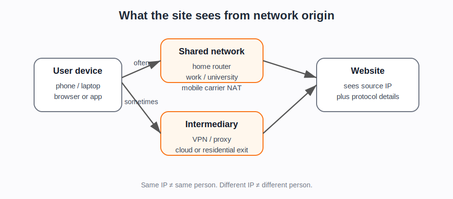

# IP addresses and network origin

## Plain explanation

An IP address is the network address that lets computers send data to each other over the Internet.

When your browser requests a web page, the website receives a request from an IP address. That address is not the same thing as your name, your device, or your account. It is closer to a return address for network traffic.

In practice, an IP address can help a website infer:

- which network the request came from
- roughly where that network is located
- whether the address belongs to home broadband, mobile, cloud, VPN, proxy, company, university, or hosting infrastructure
- whether the same address or nearby addresses have a history of suspicious traffic

## Why IP addresses can be grouped

IP addresses are allocated in blocks. Those blocks are often associated with organisations such as internet service providers, mobile networks, universities, companies, cloud providers, or hosting firms.

That means a website or security provider can group traffic by:

- exact IP address
- IP range or subnet
- organisation or network owner
- autonomous system number (ASN)
- country or region
- residential, mobile, datacentre, VPN, proxy, or hosting network
- previous reputation of that IP, range, or network

## Why IP alone is weak evidence

An IP address does not reliably identify one person.

Several people can share one public IP address because of household routers, workplaces, universities, public Wi-Fi, mobile networks, or network address translation. One person can also appear from many IP addresses because they move between home broadband, mobile data, work, VPNs, proxies, or cloud services.

So IP is useful, but it should be treated as one signal, not proof.

::: {.callout-tip}
## Simple rule

Use IP address as **network-origin evidence**, not as **person identity evidence**.
:::

## What the newer evidence adds

The later evidence makes this page more important, not less important.

Modern bot and scraping discussions often distinguish between datacentre, residential, mobile, VPN, and proxy traffic. Defender-side sources treat network origin and reputation as part of a risk bundle ([Cloudflare Bot Management]{.source-ref}). Scraper-side and proxy-side sources show why IP rotation and residential exits matter operationally ([RoundProxies, Rnet]{.source-ref}).

That does not make IP evidence decisive. It means the project should be careful with both extremes:

- “same IP = same person” is wrong
- “different IP = different person” is also wrong
- “residential IP = normal user” is too strong
- “datacentre IP = bad bot” is also too strong

## Why this matters for bot detection

Bot detection systems often use IP-related signals because many abusive requests come from known hosting networks, proxy networks, VPNs, or reused infrastructure.

But defenders cannot rely only on IP. A bad bot can use residential proxies or rotate addresses. A real user can appear from a suspicious network. So IP signals are usually combined with cookies, headers, browser fingerprints, account history, and behaviour.

## Project use

Use this note before discussing:

- IP reputation
- datacentre versus residential proxies
- VPNs
- mobile carrier NAT
- ASN blocking
- residential proxy abuse
- rate limiting by IP
- why “same IP” does not always mean “same person”

## Sources used on this page

::: {.sources-used}

- **Wikipedia, IP address** — Wikipedia contributors. *IP address*.
- **Wikipedia, Network address translation** — Wikipedia contributors. *Network address translation*.
- **Wikipedia, Autonomous system** — Wikipedia contributors. *Autonomous system (Internet)*.
- **MDN, Overview of HTTP** — MDN Web Docs (2026). *An overview of HTTP* (`SRC-065`).
- **RoundProxies, Rnet** — RoundProxies / Bernard, M. (2025). *How to Use Rnet: The Blazing-Fast Python HTTP Client* (`SRC-029`).
- **Cloudflare Bot Management** — Cloudflare (2026). *Bot Management documentation* (`SRC-003`).

:::

---

**Foundations navigation**

Next: [02. Cookies and sessions](02-cookies-and-sessions.md)
