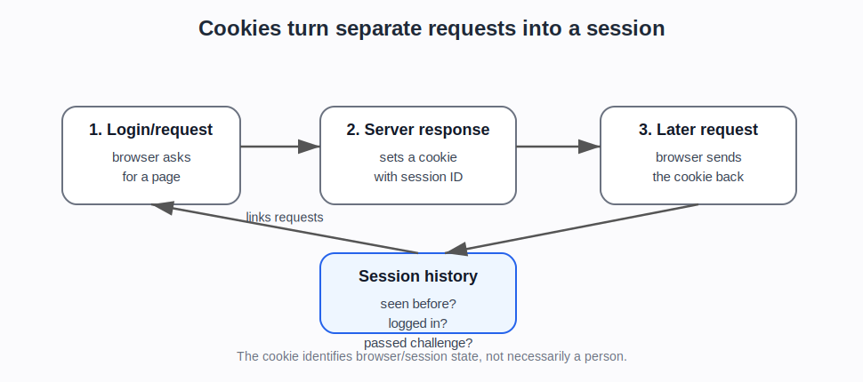

# Cookies and sessions

## Plain explanation

A cookie is a small piece of data that a website asks the browser to store.

When the browser later requests another page from the same site, it can send that cookie back. This lets the site remember that the browser has been seen before.

HTTP is stateless by default. That means each request is separate unless the site uses something like a cookie to link requests together.

## Simple example

1. You log in to a website.
2. The server checks your username and password.
3. If the login is correct, the server sends back a cookie containing a session identifier.
4. Your browser stores the cookie.
5. On later page requests, your browser sends the cookie back.
6. The server uses the session identifier to know this is still the same logged-in browser session.

The cookie normally does not need to contain your password. It can contain an opaque session ID that the server looks up.

## Common uses

Cookies are commonly used for:

- login sessions
- shopping baskets
- remembering preferences
- analytics
- tracking behaviour
- fraud and bot detection
- challenge or clearance state, where a browser has already passed some check

## Why cookies matter for bot detection

Cookies help websites distinguish between:

- a completely new browser
- a browser seen before
- a logged-in session
- a browser that has passed a challenge
- a browser with suspicious or inconsistent history

For example, a bot may make many requests but have no stable cookie history. Or it may create a fresh browser profile for each action. That can look different from a normal user who has a longer-lived cookie/session history.

The reverse can also happen. More advanced automation may preserve cookies and browser profiles across sessions, which makes it look less like a brand-new script and more like a returning browser.

## Security and privacy points

Cookies are powerful because they link requests together.

That is useful for keeping someone logged in. It is also why stolen session cookies can be dangerous: if an attacker gets a valid session cookie, a website may treat them as the logged-in user.

Cookies can also be used for tracking, especially when they persist for a long time or are used across sites.

## What cookies cannot show

A cookie identifies a browser/session, not necessarily a person.

Cookies can be deleted, copied, blocked, stolen, or separated across browser profiles. Bots can preserve cookies between requests. Real users can clear cookies or use private browsing.

So cookies are useful, but they are not perfect identity.

::: {.callout-tip}
## Simple rule

Cookies are strong evidence of **session continuity**. They are weak evidence of **who is actually controlling the session**.
:::

## What the newer evidence adds

The newer evidence makes cookie/session state a bridge between foundations and automation capability.

MDN gives the neutral mechanics. PortSwigger-style authentication sources explain why sessions matter for login security and account abuse. Browser automation sources show that automated tools can extract, reuse, or preserve cookie state. Cloud browser platforms and persistent browser profiles make this more than a theoretical point.

That means this page should prepare the reader for two later ideas:

1. lack of cookie history can be suspicious in some flows
2. cookie continuity alone does not prove the user is human

## Project use

Use this note before discussing:

- session history
- login state
- Cloudflare `__cf_bm`
- challenge clearance and pre-clearance cookies
- account takeover
- credential stuffing
- browser profiles
- persistent sessions in cloud-browser platforms
- why deleting cookies can make a user look “new”

## Sources and evidence anchors

- MDN, “Using HTTP cookies”: https://developer.mozilla.org/en-US/docs/Web/HTTP/Guides/Cookies
- Wikipedia, “HTTP cookie”: https://en.wikipedia.org/wiki/HTTP_cookie
- Evidence register anchors: MDN cookies (`SRC-062`); MDN HTTP authentication (`SRC-061`); Playwright cookie/session-state example (`SRC-028`); PortSwigger authentication sources (`SRC-069`–`SRC-072`).

---

**Foundations navigation**

Previous: [01. IP addresses and network origin](01-ip-addresses-and-network-origin.md)  
Next: [03. HTTP headers, User-Agent, and browser claims](03-http-headers-user-agent-and-client-hints.md)
