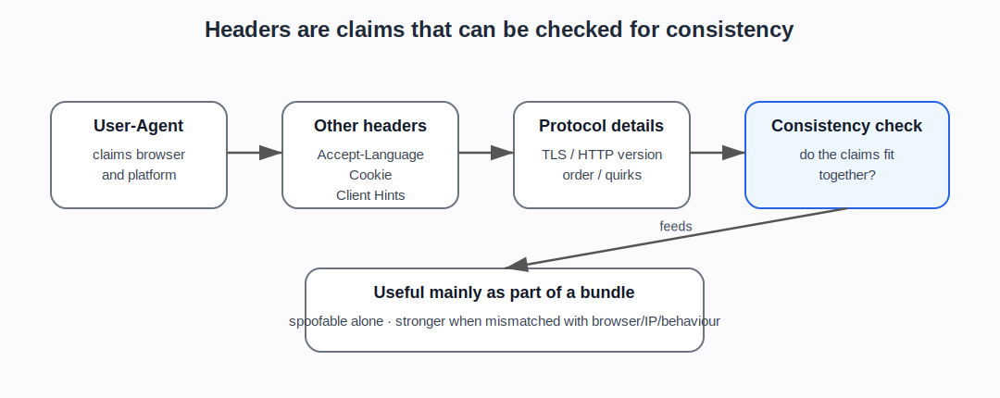

# HTTP headers, User-Agent, and browser claims

## Plain explanation

When a browser asks a website for a page, it sends an HTTP request. That request includes headers: small pieces of information about the request.

Headers can say things like:

- what page is being requested
- what browser the client claims to be
- what languages it prefers
- what content types it accepts
- what site referred the user
- what cookies are being sent
- whether the request is compressed
- extra browser or device hints

## User-Agent

The User-Agent header is a string that says what software is making the request.

For a normal browser, it may include the browser family, version, operating system, and rendering engine. For a bot, it may say something like a crawler name. But it can also lie.

That is the key point: User-Agent is a claim, not proof.

## Client hints

Modern browsers may also send client hints, which provide structured information about the browser, platform, device, or preferences. These can be useful, but they are also part of the fingerprinting and consistency problem.

A site may compare User-Agent, client hints, ordinary headers, JavaScript-visible browser features, and protocol behaviour. A mismatch can matter more than any one field.

## Why headers matter for bot detection

Headers are useful because real browsers tend to send headers in consistent ways.

Suspicious signs can include:

- missing headers that a real browser would normally send
- strange header order
- a User-Agent that claims Chrome but headers that do not match Chrome
- language, platform, timezone, or client-hint inconsistencies
- headers that match automation libraries rather than real browsers
- datacentre traffic claiming to be a normal residential browser

A single odd header is not proof. But inconsistent headers can add to a risk score.

## Why headers are not enough

Headers are easy to spoof.

A simple script can set a User-Agent string. More advanced automation can copy realistic headers. Scraping tools and stealth browsers often try to make headers match real browsers.

So headers are useful mainly when combined with other signals:

- IP/network
- cookies
- TLS fingerprint
- JavaScript-exposed browser features
- timing and behaviour
- account/session history

::: {.callout-tip}
## Simple rule

Do not ask “what does the User-Agent say?” in isolation. Ask “does the whole request look like the browser it claims to be?”
:::

## What the newer evidence adds

The newer evidence gives this page a clearer role. It is not just “what is a header?” It is the start of **claim checking**.

MDN gives the neutral vocabulary for headers and User-Agent. Cloudflare Detection IDs and related bot-management sources show why claimed-browser consistency, header order, verified-bot classification, and anomaly tags matter in operational bot management. Scraper-side sources show the opposing pressure: tooling tries to make headers, fingerprints, TLS, and browser behaviour line up.

That supports the project’s main framing: bot detection often checks coherence across weak signals, not one obvious marker.

## Project use

Use this note before discussing:

- User-Agent spoofing
- User-Agent reduction and Client Hints
- browser fingerprint inconsistency
- Cloudflare Detection IDs
- header-order mismatch
- ScrapFly/Bright Data header/fingerprint management
- stealth plugins
- why bot detection checks consistency, not just one field

## Sources and evidence anchors

- MDN, “HTTP headers”: https://developer.mozilla.org/en-US/docs/Web/HTTP/Reference/Headers
- MDN, “User-Agent header”: https://developer.mozilla.org/en-US/docs/Web/HTTP/Reference/Headers/User-Agent
- Wikipedia, “User-Agent header”: https://en.wikipedia.org/wiki/User-Agent_header
- Evidence register anchors: MDN HTTP headers (`SRC-064`); MDN User-Agent header (`SRC-063`); Cloudflare Detection IDs (`SRC-056`).

---

**Foundations navigation**

Previous: [02. Cookies and sessions](02-cookies-and-sessions.md)  
Next: [04. Browser and device fingerprinting](04-browser-and-device-fingerprinting.md)
