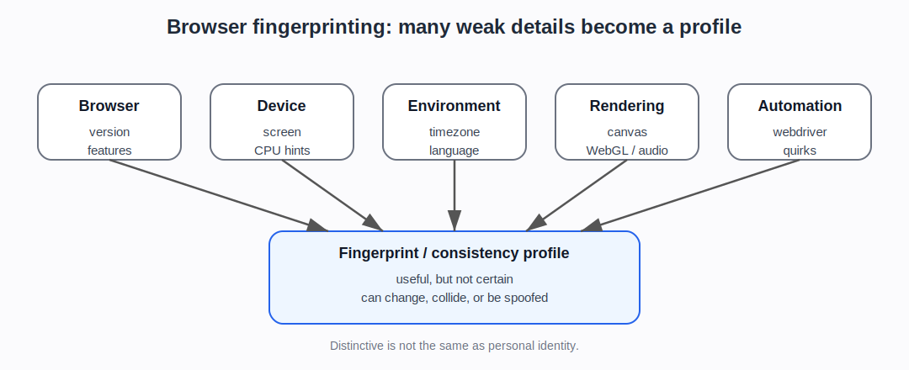

# Browser and device fingerprinting

## Plain explanation

Browser fingerprinting means collecting details about a browser, device, and environment, then combining them into a profile.

Each detail may be ordinary on its own. But the combination can become distinctive.

Examples include:

- browser type and version
- operating system
- screen size
- timezone
- language
- fonts
- plugins
- graphics/WebGL behaviour
- audio/canvas rendering
- CPU or hardware hints
- touch support
- installed features
- JavaScript API behaviour
- automation markers or browser quirks

## Why the combination matters

One signal usually does not identify a browser.

For example, many people use Chrome. Many people have the same screen size. Many people are in the same timezone.

But the combination of browser version, screen size, language, timezone, fonts, graphics behaviour, and other details can be much more distinctive.

This is why fingerprinting is sometimes described as “many weak signals becoming one stronger signal”.

## How this differs from cookies

Cookies are stored identifiers. A website gives the browser a value and asks for it back later.

Fingerprinting is different. It tries to recognise the browser from its observable properties, even if cookies are absent or deleted.

In practice, websites and anti-bot systems may use both.

## Why this matters for bot detection

Bot detection systems can use fingerprinting to check whether a browser looks real and internally consistent.

Suspicious signs can include:

- browser claims Chrome but JavaScript behaviour does not match Chrome
- WebGL or canvas output looks unusual
- `navigator.webdriver` or automation markers are present
- plugins/codecs/fonts do not match the claimed platform
- screen, timezone, language, IP location, and headers do not line up
- the same fingerprint appears across many accounts or IPs
- too many “new” fingerprints appear in a short time

## Why fingerprinting is not perfect

Fingerprints can change when users update browsers, change settings, use privacy tools, install fonts, switch devices, use private browsing, or change networks.

Bots can also try to spoof, patch, or randomise fingerprint signals.

That means fingerprinting is useful but not certain. A good bot-detection system should treat it as one part of a broader risk judgement.

::: {.callout-warning}
## Important caveat

“Distinctive browser” is not the same as “known person”. Browser fingerprints can be unstable, shared, spoofed, or affected by privacy tools.
:::

## What the newer evidence adds

The newer evidence gives this page two jobs.

First, it needs to explain the simple mechanism: many observable browser details can be combined. The older EFF and browser-fingerprinting sources are enough for that.

Second, it needs to prepare the reader for the arms race. Academic papers and surveys cover uniqueness, inconsistencies, privacy, and evasion. Defender-side sources use fingerprints and browser checks as part of detection. Scraper-side and stealth-tool sources explicitly talk about changing or hiding automation fingerprints.

The safest wording is therefore:

> Fingerprinting can add useful consistency and recognition evidence, but it does not prove identity, intent, or abuse by itself.

## Project use

Use this note before discussing:

- FP-Inspector
- Laperdrix-style browser fingerprinting surveys
- browser fingerprint uniqueness and demographics
- browser fingerprint inconsistencies
- stealth plugins
- anti-detect browsers
- Cloudflare JA3/JA4 and browser signals
- ScrapFly/Bright Data fingerprint management
- privacy and regulatory questions around bot detection

## Sources and evidence anchors

- Wikipedia, “Device fingerprint”: https://en.wikipedia.org/wiki/Device_fingerprint
- EFF, “Cover Your Tracks”: https://coveryourtracks.eff.org/
- MDN, “Browser detection using the user agent”: https://developer.mozilla.org/en-US/docs/Web/HTTP/Browser_detection_using_the_user_agent
- Evidence register anchors: Laperdrix et al. browser fingerprinting survey; Berke et al. browser uniqueness/demographics; Martínez Llamas et al. privacy/GDPR/AI Act review (`SRC-047`); scraper-side anti-detection taxonomy (`SRC-046`).

---

**Foundations navigation**

Previous: [03. HTTP headers, User-Agent, and browser claims](03-http-headers-user-agent-and-client-hints.md)  
Next: [05. Proxies, VPNs, NAT, and shared addresses](05-proxies-vpns-nat-and-shared-addresses.md)
