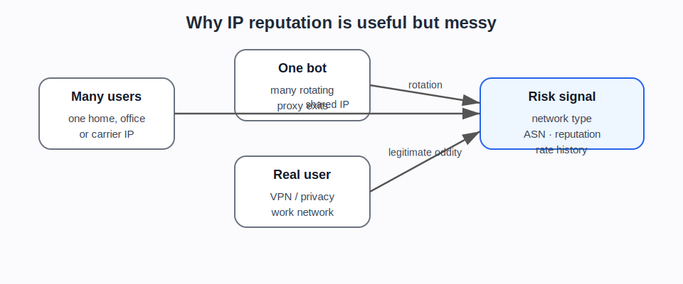

# Proxies, VPNs, NAT, and shared addresses

## Plain explanation

A website usually sees the IP address that connects to it. But that does not always mean it is seeing the user’s own device address.

Several technologies can sit between the user and the website.

## NAT

Network address translation, or NAT, lets multiple devices share one public IP address.

This is common in homes, offices, schools, public Wi-Fi, and mobile networks.

A website might see many users coming from one IP address because they are behind the same router, company gateway, university network, or mobile carrier NAT.

## Proxy server

A proxy server makes requests on behalf of another client.

To the target website, the request may appear to come from the proxy rather than the original user.

Proxies can be used for caching, filtering, privacy, corporate controls, scraping, testing, or abuse.

## VPN

A VPN routes traffic through a tunnel to another network. The website often sees the VPN exit IP rather than the user’s home or mobile IP.

VPNs can be legitimate privacy or work tools. They can also make it harder to use IP address alone as identity evidence.

## Residential and datacentre proxies

A datacentre proxy uses IP addresses associated with hosting or cloud infrastructure.

A residential proxy uses IP addresses associated with normal consumer internet connections. These may look more like ordinary users, which is why they matter for bot detection.

Mobile proxies use mobile carrier networks. They can be especially messy because carrier NAT already means many legitimate users may share visible network origins.

## Why this matters for bot detection

IP reputation is useful but messy.

A website may see:

- many real users sharing one IP
- one bot rotating through many IPs
- one attacker using residential proxies
- a legitimate user on a VPN
- a workplace or school network with many users
- cloud-hosted automation from datacentre IPs
- mobile users changing addresses frequently

This is why bot systems use IP as one signal, not the whole decision.

::: {.callout-tip}
## Simple rule

Network origin can make traffic more or less suspicious. It cannot prove identity or intent by itself.
:::

## What the newer evidence adds

The newer evidence makes the proxy discussion less theoretical.

Proxy-side and scraping-side sources show that proxy rotation, residential exits, and managed scraping infrastructure are part of the supply side. Defender-side sources show that network reputation, ASN, datacentre/residential classification, and rate history are common parts of risk scoring.

The careful framing is:

- residential-looking traffic can still be automated
- datacentre-looking traffic can still be legitimate
- VPN or proxy use is not automatically abusive
- repeated patterns across IPs, accounts, cookies, fingerprints, and behaviour are stronger than IP alone

## Project use

Use this note before discussing:

- residential proxies
- datacentre proxies
- mobile proxies
- proxy rotation
- IP reputation
- ASN blocking
- rate limiting
- cloud-browser provider infrastructure
- why “same IP = same person” is wrong
- why “different IP = different person” is also wrong

## Sources and evidence anchors

- Wikipedia, “Network address translation”: https://en.wikipedia.org/wiki/Network_address_translation
- Wikipedia, “Proxy server”: https://en.wikipedia.org/wiki/Proxy_server
- Wikipedia, “Virtual private network”: https://en.wikipedia.org/wiki/Virtual_private_network
- Evidence register anchors: RoundProxies Rnet tutorial (`SRC-029`); ScrapFly/Bright Data/managed scraping sources; Cloudflare/DataDome/HUMAN bot-management sources using network-origin and reputation signals.

---

**Foundations navigation**

Previous: [04. Browser and device fingerprinting](04-browser-and-device-fingerprinting.md)  
Next: [06. How websites recognise visitors](06-how-websites-recognise-visitors.md)
