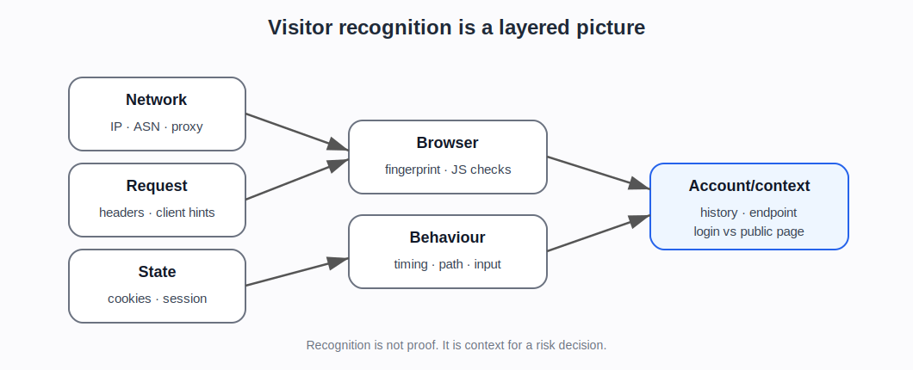

# How websites recognise visitors

## Plain explanation

A website rarely recognises a visitor from one signal.

Instead, it sees a bundle of signals. Some are sent automatically with the request. Some are stored in the browser. Some are collected after JavaScript runs. Some come from behaviour over time.

The website may combine them to decide whether the visitor looks familiar, new, trusted, suspicious, automated, or risky.

## The basic chain

### 1. The request arrives

The website sees a request for a page or API endpoint.

At minimum, it sees network information such as the source IP address and protocol-level details.

### 2. The request has headers

The browser sends HTTP headers. These may include cookies, language preferences, accepted content types, User-Agent, and other details.

Headers tell the server what the client claims about itself. They are useful, but they can be spoofed.

### 3. The browser may send cookies

If the site has already set cookies, the browser may send them back.

Cookies let the site link the current request to an earlier visit, login session, shopping basket, challenge result, or preference.

### 4. JavaScript can collect browser details

If JavaScript runs, the site can learn more about the browser and environment, such as screen size, timezone, fonts, graphics behaviour, browser features, and automation markers.

These details can contribute to a browser/device fingerprint.

### 5. Behaviour adds context

The site can observe behaviour:

- how fast pages are requested
- whether the user clicks, scrolls, types, and waits
- whether the journey makes sense
- whether requests repeat in a pattern
- whether many accounts behave similarly
- whether many sessions use the same infrastructure

### 6. Account history adds more context

For logged-in areas, the site can compare current activity with account history:

- usual device
- usual country or network
- normal login time
- past failed logins
- payment history
- order history
- previous fraud signals

## Why combining signals matters

Each signal is weak alone.

- IP address can be shared or changed.
- Cookies can be deleted, stolen, copied, or preserved by automation.
- Headers can be spoofed.
- Fingerprints can change or be faked.
- Behaviour can vary between real users.
- Real users can use VPNs, privacy browsers, or unusual devices.

The strength comes from the combination.

A bot detection system is often asking: does this whole bundle look like a normal human session, a trusted automated bot, a new/unknown visitor, or suspicious automation?

## A simple example

A request says it is Chrome on Windows.

But:

- the IP belongs to a datacentre
- there is no cookie history
- the browser fingerprint is inconsistent with Chrome
- the timezone does not match the IP location
- the request rate is very fast
- the same pattern appears across many accounts

No single fact proves it is a bot. Together, they make the session riskier.

## What the newer evidence adds

The newer evidence supports this page as the bridge from “web basics” to “bot detection”.

The MDN sources explain the mechanics of HTTP, cookies, authentication, headers, CORS, and caching ([MDN web foundations]{.source-ref}). The Cloudflare, DataDome, HUMAN, Kasada, Arkose, and similar sources show these mechanics being reused as risk signals ([Cloudflare Bot Management]{.source-ref}; [Cloudflare detection engines]{.source-ref}; [Cloudflare Detection IDs]{.source-ref}). Academic fingerprinting and behavioural sources explain narrower technical mechanisms. Scraper-side sources show why attackers and automation providers try to align those same signals.

This means the page should keep repeating one discipline:

> Recognition is a bundle of clues. It is not personal identity, and it is not proof of abuse by itself.

## Project use

This is the bridge between the foundations notes and the bot-detection evidence.

Use this before introducing:

- bot scores
- behaviour models
- browser fingerprinting papers
- Cloudflare/DataDome/HUMAN/Kasada/Arkose docs
- stealth tooling
- residential proxies
- cloud browsers
- AI browser agents

## Sources used on this page

::: {.sources-used}

- **MDN web foundations** — MDN Web Docs (2026). *Overview of HTTP; Using HTTP cookies; HTTP headers; User-Agent header* (`SRC-062`-`SRC-065`).
- **Cloudflare Bot Management** — Cloudflare (2026). *Bot Management documentation* (`SRC-003`).
- **Cloudflare detection engines** — Cloudflare (2026). *Bot detection engines* (`SRC-057`).
- **Cloudflare Detection IDs** — Cloudflare (2026). *Detection IDs* (`SRC-056`).

:::

---

**Foundations navigation**

Previous: [05. Proxies, VPNs, NAT, and shared addresses](05-proxies-vpns-nat-and-shared-addresses.md)  
Next: [07. How visitor recognition becomes bot detection](07-how-this-becomes-bot-detection.md)
