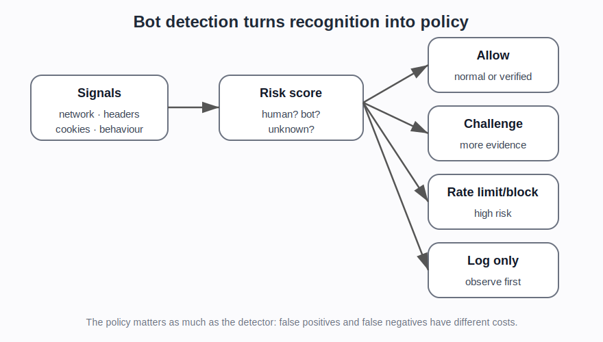

# How visitor recognition becomes bot detection

## Plain explanation

Bot detection is not usually a perfect yes/no decision.

It is usually a risk judgement based on many signals.

The question is not only:

> Is this a bot?

It is often more like:

> What kind of traffic is this, how risky is it, and what should the site do with it?

## Four broad traffic categories

A website may want to separate traffic into rough categories:

1. **Normal human users**  
   People browsing, logging in, buying, reading, or using the site normally.

2. **Good bots**  
   Search engines, monitoring tools, accessibility tools, partner crawlers, or verified agents that the site wants to allow.

3. **Unknown automation**  
   Scripts, crawlers, browser automation, scraping tools, or agents whose purpose is unclear.

4. **Bad bots / abusive automation**  
   Credential stuffing, scraping, fake account creation, scalping, carding, inventory hoarding, spam, fraud, or account takeover.

## Common signal groups

Bot systems may use:

- IP and network reputation
- ASN, datacentre, residential, mobile, VPN, or proxy classification
- request headers
- cookies and session history
- browser/device fingerprints
- TLS or protocol fingerprints
- JavaScript challenge results
- mouse/keyboard/touch behaviour
- request timing and rate
- account history
- endpoint context, such as login versus public page
- known good bot verification
- known bad fingerprints or detection IDs

## From signal to action

A bot system may respond in different ways:

- allow
- block
- rate limit
- challenge
- ask for stronger authentication
- log only
- serve different content
- skip protection for verified bots
- send a risk score to the origin application

This matters because “bot detection” is not just detection. It is also response policy.

## Why false positives matter

A false positive means a real user is treated as a bot.

That can block customers, break login, stop purchases, or damage trust.

This is why many systems use risk scores and graduated responses instead of always blocking.

## Why false negatives matter

A false negative means abusive automation is allowed through.

That can lead to scraping, account takeover, fake accounts, payment fraud, scalping, inventory hoarding, or inflated infrastructure cost.

## Why attackers adapt

If a website blocks obvious scripts, attackers may move to:

- realistic headers
- browser automation
- stealth plugins
- undetected drivers
- residential proxies
- CAPTCHA solvers
- cloud browsers
- persistent profiles
- AI browser agents

That is why the project needs a simple-to-complex automation taxonomy.

::: {.callout-note}
## Boundary of the evidence

A vendor saying it uses a signal is useful evidence that the signal exists in production products. It is not, by itself, proof of accuracy, prevalence, false-positive rate, or real-world harm.
:::

## What the newer evidence adds

The newer evidence broadens this page from classic “bot detection” into **traffic governance**.

Cloudflare sources add bot scores, Detection IDs, Turnstile, verified bots, AI-bot controls, and endpoint-specific policy ([Cloudflare Bot Management]{.source-ref}; [Cloudflare Turnstile]{.source-ref}; [Cloudflare Detection IDs]{.source-ref}). DataDome, HUMAN, Kasada, Arkose, Thales, and Akamai-style sources add production-facing categories of abuse and mitigation ([DataDome / HUMAN / Kasada / Arkose]{.source-ref}; [Thales / Akamai]{.source-ref}). OWASP provides the broad threat taxonomy ([OWASP Automated Threat Handbook]{.source-ref}). Academic studies help explain specific signals such as fingerprinting and behavioural checks.

The page should therefore avoid a simplistic story where bot detection means “find bots and block them”. The better framing is:

> classify traffic, estimate risk, choose a proportionate response, and keep the cost of mistakes visible.

## Project use

This page should introduce the advanced evidence set:

- OWASP automated-threat categories
- Cloudflare bot scores and Detection IDs
- Cloudflare Turnstile and AI-bot controls
- DataDome intent-based detection
- HUMAN cyberfraud and agentic traffic
- Kasada proof-of-execution and retooling
- Arkose dynamic challenges
- academic behavioural and fingerprinting studies
- automation supply-side sources

## Sources used on this page

::: {.sources-used}

- **OWASP Automated Threat Handbook** — OWASP / Watson, C., & Zaw, T. (2026). *Automated Threat Handbook: Web Applications v1.3* (`SRC-027`).
- **Cloudflare Bot Management** — Cloudflare (2026). *Bot Management documentation* (`SRC-003`).
- **Cloudflare Turnstile** — Cloudflare (2026). *Turnstile — Overview* (`SRC-055`).
- **Cloudflare Detection IDs** — Cloudflare (2026). *Detection IDs* (`SRC-056`).
- **Cloudflare bot solutions overview** — Cloudflare (2026). *Bot solutions — Overview* (`SRC-058`).
- **DataDome / HUMAN / Kasada / Arkose** — Defender-vendor material on bot management, intent, challenges, proof-of-execution, and agentic traffic.
- **Thales / Akamai** — Vendor telemetry and trend reports on bad-bot and financial-services attack activity.

:::

---

**Foundations navigation**

Previous: [06. How websites recognise visitors](06-how-websites-recognise-visitors.md)  
Next: [08. Automation techniques: from scripts to browser agents](08-automation-techniques-from-scripts-to-browser-agents.md)
