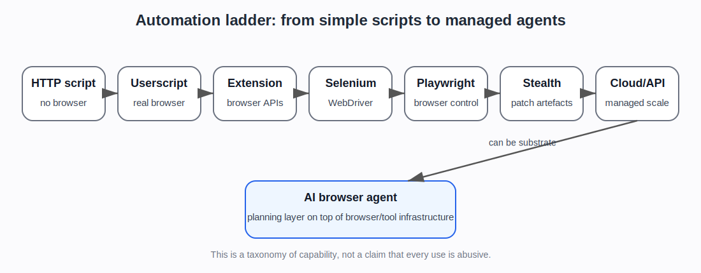

# Automation techniques: from scripts to browser agents

## Plain explanation

Not all bots work the same way.

Some bots are simple scripts that send HTTP requests. Others control a real browser. Others use cloud browser services, stealth plugins, proxies, CAPTCHA solvers, or AI agents.

A useful taxonomy should explain the ladder from simple to complex.

::: {.callout-note}
## Capability is not intent

The same technique can be used for testing, accessibility, monitoring, personal automation, research, scraping, fraud, or abuse. This page classifies capability. It does not say every use is malicious.
:::

## 1. HTTP request scripts

A script can send requests directly to a website or API without opening a browser.

Examples:

- Python `requests`
- `curl`
- custom API clients
- simple scraping scripts

Strengths:

- fast
- cheap
- easy to scale
- no browser overhead

Weaknesses:

- may not run JavaScript
- may miss cookies or dynamic content
- may send unrealistic headers
- easier to fingerprint if naive

## 2. Userscripts and Tampermonkey

A userscript is JavaScript that runs inside the user’s browser and modifies pages.

Tampermonkey is a browser extension that manages userscripts.

This is different from Selenium or Playwright. The browser is real and user-controlled, but extra JavaScript changes page behaviour.

Uses:

- modifying website interfaces
- automating small repetitive tasks
- extracting page data
- changing forms or buttons
- adding custom controls

Detection implications:

- traffic may come from a real browser and real user session
- automation may be partly hidden inside normal browsing
- it is harder to classify from network traffic alone
- but the script is limited to what it can do inside the page/browser context

## 3. Browser extensions

A browser extension can add deeper browser features than a simple userscript.

Extensions can interact with pages, tabs, requests, storage, and browser APIs depending on permissions.

Uses:

- password managers
- ad blockers
- testing tools
- scraping helpers
- automation helpers
- privacy tools

Detection implications:

- extensions can affect browser behaviour and fingerprint
- some anti-fraud systems may care about extension-related signals
- extensions can be legitimate, suspicious, or irrelevant depending on context

## 4. Selenium / WebDriver

Selenium controls a browser through WebDriver.

It is widely used for testing web applications.

Uses:

- end-to-end testing
- form filling
- login flows
- browser interaction
- scraping dynamic sites
- QA automation

Detection implications:

- vanilla Selenium can leave automation markers
- tools such as `undetected-chromedriver` try to patch those markers
- it is a common baseline for browser automation

## 5. Puppeteer and Playwright

Puppeteer and Playwright are modern browser automation frameworks.

They can launch browsers, click, type, navigate, intercept network requests, manage contexts, run headless or headed, and automate complex workflows.

Uses:

- testing
- scraping
- screenshots/PDFs
- browser workflows
- AI browser agents
- monitoring

Detection implications:

- vanilla automation may be detectable
- stealth plugins and wrappers try to reduce inconsistencies
- Playwright/Puppeteer are common bases for cloud-browser and AI-agent stacks
- preserved browser contexts and cookies can make automation look less like a fresh script

## 6. Stealth plugins and undetected drivers

These tools try to make browser automation look less automated.

Examples:

- `puppeteer-extra-plugin-stealth`
- `undetected-chromedriver`
- SeleniumBase UC Mode
- Nodriver
- Camoufox-style tools

They may patch or hide:

- `navigator.webdriver`
- User-Agent oddities
- missing plugins
- WebGL differences
- iframe behaviour
- codec support
- Chrome runtime features
- headless-browser artefacts

Detection implications:

- this is explicit evasion tooling
- it may pass public bot tests
- that does not prove it bypasses production anti-bot systems
- IP reputation, cookies, behaviour, TLS fingerprints, and account history still matter

## 7. Anti-detect browsers

Anti-detect browsers package browser profile control as a product.

They may manage:

- fingerprints
- proxies
- cookies
- browser profiles
- timezones
- languages
- WebRTC settings
- team workflows

Detection implications:

- often discussed in relation to multi-accounting, affiliate fraud, ad fraud, scraping, and grey-market automation
- also used for testing and privacy
- stronger evidence would need specific product/docs or studies

## 8. Cloud browsers and browser APIs

Cloud browser platforms run browsers for the user in the cloud.

Examples from the evidence set:

- Browserless
- Browserbase
- Hyperbrowser
- Bright Data Browser API
- ScrapFly Cloud Browser

They may provide:

- hosted browsers
- Playwright/Puppeteer/Selenium access
- persistent sessions
- proxies
- CAPTCHA solving
- stealth modes
- live view and recordings
- large-scale parallel sessions
- AI-agent integrations

Detection implications:

- browser automation becomes infrastructure
- users do not need to build their own browser cluster
- legitimate and abusive uses overlap
- defenders must consider cloud-browser fingerprints and provider infrastructure

## 9. Scraping APIs and web unlockers

Scraping APIs abstract away the browser and proxy work.

Examples from the evidence set:

- ScrapFly Anti Scraping Protection
- Bright Data Web Unlocker

They may handle:

- proxy rotation
- headers
- fingerprints
- TLS fingerprints
- JavaScript rendering
- CAPTCHA solving
- retries
- anti-bot bypass logic

Detection implications:

- the user may only submit a URL and receive HTML/JSON
- the anti-bot bypass stack is hidden behind an API
- this is strong supply-side evidence, but not proof of malicious use

## 10. AI browser agents

AI agents add a planning layer on top of browser automation.

They may:

- read page content
- decide what to click
- fill forms
- use tools
- log into services
- navigate multi-step flows
- interact with cloud browsers
- use MCP or computer-use APIs

Detection implications:

- they may reuse Selenium, Playwright, Puppeteer, or cloud-browser sessions
- they can look like ordinary browser automation at the technical layer
- their intent may differ: assistant, crawler, shopper, scraper, attacker, or legitimate delegated agent
- identity and authorisation become more important

## Simple comparison

| Technique | Runs a browser? | Easy to scale? | Can run JavaScript? | Typical detection issue |
|---|---:|---:|---:|---|
| HTTP script | No | High | No | unrealistic headers/timing |
| Userscript/Tampermonkey | Yes, user browser | Low/medium | Yes | hidden automation in real session |
| Browser extension | Yes, user browser | Low/medium | Yes | extension/browser-state signals |
| Selenium | Yes | Medium | Yes | WebDriver markers |
| Puppeteer/Playwright | Yes | Medium/high | Yes | headless/automation artefacts |
| Stealth plugins | Yes | Medium/high | Yes | patched but still inconsistent elsewhere |
| Anti-detect browser | Yes | Medium/high | Yes | profile/proxy/account consistency |
| Cloud browser | Yes, remote | High | Yes | provider/cloud/session fingerprints |
| Web unlocker API | Hidden/managed | High | Often | provider bypass stack |
| AI browser agent | Usually | Medium/high | Yes | agent intent and browser substrate |

## What the newer evidence adds

The newer evidence supports this page as the taxonomy bridge.

The project now has foundation sources for HTTP, cookies, headers, User-Agent, authentication, CORS, caching, and browser fingerprinting ([MDN web foundations]{.source-ref}). It also has evidence from defender products, scraper-side vendors, cloud browser providers, stealth tooling, and AI-agent traffic sources ([Playwright / Puppeteer / Selenium docs]{.source-ref}; [stealth tooling]{.source-ref}; [scraping and cloud-browser sources]{.source-ref}; [HUMAN agentic traffic sources]{.source-ref}).

That means the automation taxonomy should do one specific job:

> connect the simple web foundations to the realistic ways automation is built and packaged.

It should not overclaim that the existence of a tool proves abuse. It should show why defenders need multiple weak signals and why the project separates capability evidence from harm/prevalence evidence.

## Project use

This page should be the simple taxonomy bridge.

It lets a reader understand why the project has both:

- foundations sources about IPs, cookies, headers, fingerprints
- academic sources about behaviour and fingerprinting
- vendor defender sources
- automation supply-side sources
- open-source evasion tooling

The key message is:

> Modern bot activity is not one thing. It ranges from simple scripts to real-browser automation, stealth tooling, managed cloud browsers, scraping APIs, and AI agents. Detection therefore combines many weak signals rather than relying on one obvious marker.

## Sources used on this page

::: {.sources-used}

- **Wikipedia, Userscript** — Wikipedia contributors. *Userscript*.
- **Wikipedia, Tampermonkey** — Wikipedia contributors. *Tampermonkey*.
- **Playwright / Puppeteer / Selenium docs** — Playwright, Puppeteer, Selenium (2026). *Official project documentation*.
- **Playwright cookies** — Playwright (2026). *Authentication / cookie and session-state documentation* (`SRC-028`).
- **stealth tooling** — `puppeteer-extra-plugin-stealth`; `undetected-chromedriver`; related Selenium and browser-automation evasion tooling.
- **scraping and cloud-browser sources** — ScrapingBee, ScrapFly, Bright Data, Browserless, Browserbase, Hyperbrowser, and related managed automation material (`SRC-041`-`SRC-046` plus cloud-browser/web-unlocker entries).
- **HUMAN agentic traffic sources** — HUMAN Security material on OpenClaw, agentic visibility, and state of agentic traffic (`SRC-036`-`SRC-038`).
- **MDN web foundations** — MDN Web Docs (2026). HTTP, cookies, headers, authentication, CORS, caching, and User-Agent foundation material.

:::

---

**Foundations navigation**

Previous: [07. How visitor recognition becomes bot detection](07-how-this-becomes-bot-detection.md)
