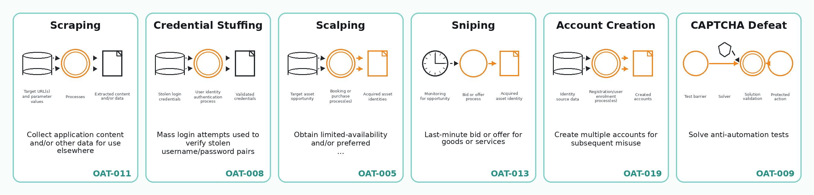

Bots are not one problem.

Automated traffic can be used to scrape data, test stolen credentials, create accounts, reserve scarce goods, distort metrics, submit spam, probe applications, or bypass defences. Calling all of this "bot traffic" is useful shorthand, but it hides important differences.

This page uses the OWASP Automated Threats vocabulary as a simple classification layer. OWASP calls these **automated threat events** and gives them OAT identifiers ([OWASP]{.source-ref}; [OWASP Automated Threat Handbook]{.source-ref}).

{fig-alt="Six selected OWASP Automated Threat tiles showing scraping, credential stuffing, scalping, sniping, account creation, and CAPTCHA defeat."}

::: {.callout-note}
The image is adapted from the OWASP Automated Threats Reference Chart for web applications. The chart and handbook are licensed under Creative Commons Attribution-ShareAlike 3.0.
:::

## Why classification matters

The same technical method can support different kinds of abuse.

A browser automation script could scrape product data, create fake accounts, reserve appointment slots, test credentials, or repeatedly submit a form. The tool alone does not tell us the threat category. We also need the purpose, target endpoint, account context, timing, and business effect.

That is why OWASP's categories are useful: they describe **what kind of automated misuse is happening**, not just which tool was used.

## A simple grouping of OWASP automated threats

The full OWASP set has 21 categories. For this project, it is easier to read them in groups.

| Group | OWASP examples | Plain meaning |
|---|---|---|
| **Account and login abuse** | Credential Stuffing, Credential Cracking, Account Creation, Account Aggregation | Automation used to test accounts, create accounts, or operate many accounts together. |
| **Payment and value abuse** | Carding, Card Cracking, Cashing Out, Token Cracking, Cost-Inflation Fraud | Automation used to test stolen payment data, extract value, enumerate codes, or trigger chargeable activity. |
| **Scarcity and market abuse** | Scalping, Sniping, Denial of Inventory, Expediting | Automation used to win limited goods, services, slots, queues, bids, or time-sensitive opportunities. |
| **Data extraction and reconnaissance** | Scraping, Footprinting, Fingerprinting, Vulnerability Scanning | Automation used to collect content, understand an application, identify technologies, or look for weaknesses. |
| **Distortion and disruption** | Denial of Service, Skewing, Spamming | Automation used to reduce availability, distort metrics, or inject unwanted content. |
| **Defence bypass** | CAPTCHA Defeat | Automation or supporting services used to pass anti-automation tests. |

This grouping is not official OWASP ordering. It is a reading aid for the foundations section.

## Examples in this project

### Scraping

Scraping means collecting application content or other data for use elsewhere. It can be benign, tolerated, unwanted, or abusive depending on context, permission, rate, and reuse.

Relevant foundations:

- IP addresses and network origin
- cookies and sessions
- headers and browser claims
- browser fingerprints
- proxies and shared addresses
- automation techniques

### Credential stuffing

Credential stuffing means trying known username/password pairs, usually obtained from another breach, against a login system. It is different from credential cracking, where automation is used to guess or discover valid credentials.

Relevant foundations:

- sessions and login state
- account history
- rate limits
- network reputation
- repeated patterns across many accounts

### Scalping, sniping, and denial of inventory

These categories are useful for thinking about scarce or time-sensitive services.

- **Scalping** is about obtaining limited-availability or preferred goods or services by unfair methods.
- **Sniping** is about last-minute bids or offers.
- **Denial of inventory** is about holding or depleting stock or service availability without completing the transaction.
- **Expediting** is about automating normally slow or tedious steps.

Appointment-slot abuse can cut across several of these categories. A single real-world case might involve expediting, sniping, scalping, account creation, account sharing, or denial of inventory. The classification depends on the business model and the effect on real users.

### CAPTCHA defeat

CAPTCHA defeat is not usually the final goal. It is a supporting step that lets another automated workflow continue, such as scraping, account creation, credential attacks, or purchasing scarce goods.

## Important ambiguity: fingerprinting

The word **fingerprinting** appears in two different ways.

In the earlier foundations pages, browser or device fingerprinting usually means a defender collecting browser, device, and environment signals to recognise or risk-score a visitor.

In OWASP OAT-004, Fingerprinting means an attacker eliciting information about the application's supporting software, frameworks, or versions.

Both meanings are valid, but they point in opposite directions:

| Term use | Who is doing it? | Purpose |
|---|---|---|
| Browser/device fingerprinting | Website, security system, or analytics system | Recognise, classify, or risk-score a visitor. |
| OWASP OAT-004 Fingerprinting | Attacker or automated tool | Learn about application technologies and versions. |

This page uses the OWASP meaning only when talking about OAT-004.

## How this connects to bot detection

The earlier foundation pages explain the signals a website can observe:

- IP and network origin
- cookies and session history
- headers and browser claims
- browser/device fingerprints
- proxy or VPN indicators
- behaviour over time
- account history

Those signals help a site decide whether a session looks normal, automated, suspicious, or abusive.

The OWASP categories help with the next question:

> If this is unwanted automation, what kind of automated threat is it?

That second question matters because the response may differ. A site might rate-limit scraping, require stronger authentication for credential attacks, redesign queues for scarcity abuse, or change business rules to reduce resale incentives.

## What OWASP can and cannot show

OWASP is useful here as a shared vocabulary. It is not enough on its own.

It can help with:

- naming common automated abuse patterns;
- separating scraping, credential attacks, account creation, scalping, sniping, and denial of inventory;
- mapping vendor claims and case studies into a common language;
- explaining automated abuse of valid application functionality.

It cannot show:

- how common each threat is today;
- which threats cause the most harm;
- which detection methods work best;
- current false-positive or false-negative rates;
- whether a particular vendor control is effective;
- whether current AI agents, cloud browsers, or anti-detect browsers change the threat mix.

For those claims, the project needs other evidence: vendor telemetry, academic studies, enforcement cases, scraper-side capability sources, and concrete case studies.

## Project use

Use this page as the end of the foundations section.

The earlier pages answer:

> What can a website observe?

The automation page answers:

> What technical methods can automation use?

This page answers:

> What kinds of unwanted activity can those methods support?

That makes it a bridge from technical foundations into the evidence register and later technique pages.

## Sources used on this page

::: {.sources-used}

- **OWASP** — OWASP Foundation (n.d.). *Automated Threats to Web Applications*.
- **OWASP Automated Threat Handbook** — OWASP / Watson, C., & Zaw, T. (2026). *Automated Threat Handbook: Web Applications v1.3*.
- **OWASP Automated Threats Reference Chart** — OWASP Foundation (2026). *Automated Threats Reference Chart - Web Applications - 20260302*. Poster tiles adapted under Creative Commons Attribution-ShareAlike 3.0.

:::
