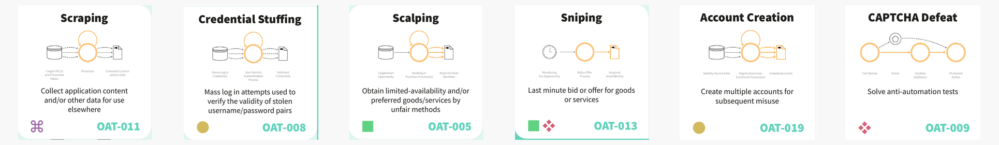

This section explains the basic technical ideas that the rest of the site relies on.

Bot and abuse prevention can become confusing quickly because many ordinary web concepts get reused as security signals: IP addresses, cookies, headers, browser fingerprints, proxies, sessions, and behaviour over time. None of these signals is decisive on its own. The important idea is how they combine into a risk judgement.

The pages here are written as on-ramps. They are not meant to be exhaustive protocol documentation. They give enough shared vocabulary to understand later sections on bot scores, browser automation, fingerprint inconsistencies, behavioural detection, residential proxies, cloud browsers, and AI browser agents.

{fig-alt="A strip of selected OWASP Automated Threat examples, including scraping, credential stuffing, scalping, sniping, account creation, and CAPTCHA defeat."}

The final foundation page uses these OWASP examples to show why bot activity needs classification. Automated abuse is not just scraping; it can involve account attacks, payment abuse, scarcity abuse, metric distortion, reconnaissance, or defence bypass.

## Reading order

Read these in order if the category is new to you. If you already know the basics, use this page as a glossary-style index.

1. [IP addresses and network origin](01-ip-addresses-and-network-origin.md)  
   What an IP address can tell a website, why network origin matters, and why IP address is useful but weak identity evidence.

2. [Cookies and sessions](02-cookies-and-sessions.md)  
   How websites link requests into sessions, remember browsers, maintain login state, and why cookies identify browser state rather than a person.

3. [HTTP headers, User-Agent, and browser claims](03-http-headers-user-agent-and-client-hints.md)  
   What browsers claim about themselves in HTTP requests, why those claims can be spoofed, and why consistency matters more than any single header.

4. [Browser and device fingerprinting](04-browser-and-device-fingerprinting.md)  
   How many weak browser, device, and environment signals can combine into a stronger profile, and why fingerprints are useful but imperfect.

5. [Proxies, VPNs, NAT, and shared addresses](05-proxies-vpns-nat-and-shared-addresses.md)  
   Why the address a website sees may be a shared network, VPN, proxy, mobile carrier, datacentre, or residential exit point.

6. [How websites recognise visitors](06-how-websites-recognise-visitors.md)  
   How network signals, headers, cookies, JavaScript-visible browser state, behaviour, and account history combine into visitor recognition.

7. [How visitor recognition becomes bot detection](07-how-this-becomes-bot-detection.md)  
   How ordinary recognition signals become risk scoring, challenge decisions, rate limits, blocks, or allow decisions.

8. [Automation techniques: from scripts to browser agents](08-automation-techniques-from-scripts-to-browser-agents.md)  
   A simple taxonomy from HTTP scripts through browser automation, stealth tooling, cloud browsers, web unlockers, and AI browser agents.

9. [Types of automated threats](09-types-of-automated-threats.md)  
   How OWASP groups unwanted automation into threat categories such as scraping, credential stuffing, scalping, sniping, account creation, denial of inventory, and CAPTCHA defeat.

## The core idea

Bot detection is rarely about finding one magic marker that proves a visitor is automated.

It is usually about asking whether a whole bundle of evidence makes sense together:

- Does the network origin fit the claimed browser, location, and account history?
- Does the browser behave like the software it claims to be?
- Does the visitor have a plausible cookie and session history?
- Do requests happen at a human pace and in a human sequence?
- Are many accounts, sessions, IPs, or fingerprints linked by repeated patterns?
- Is the traffic from a known good bot, unknown automation, or an abusive workflow?

The later sections of the site build on this foundation. The technical territory pages examine specific detection families; the methodology pages ask what can be tested with public data; the boundaries section names what remains hard to verify without commercial telemetry.
