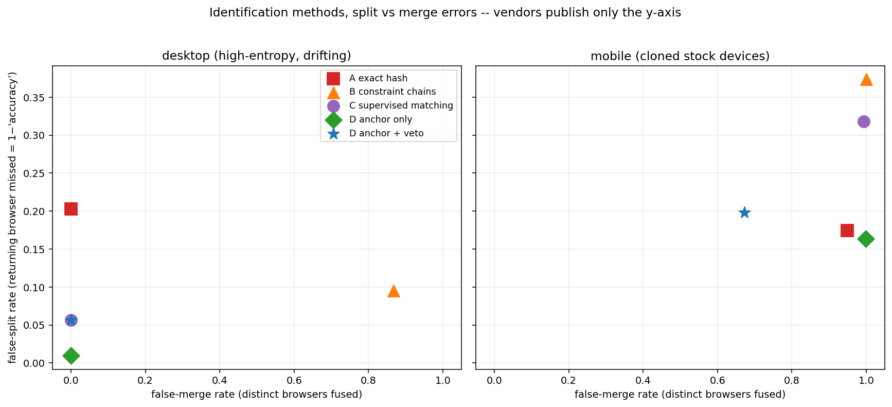

::: {.lead}
A vendor "visitor ID" or "device ID" is not a fingerprint. It is the output of a *matching process* that tries to link successive, slightly different fingerprints to the same browser over time. This experiment reconstructs that process at four levels of sophistication and measures the two errors it can make — and shows that vendors only ever publish one of them.
:::

The point is methodological, not operational. The data is synthetic, the drift and cloning rates are plausible guesses rather than measured values, and the browsers are distinguishable (or not) by construction. The experiment is useful for seeing *how the machinery works and where its parameters bite*. It is not evidence about any real vendor's accuracy, and every number below should be read as qualitative: the **ordering** of the methods and the **mechanisms** behind their failures are the content, not the specific rates.

This investigation follows directly from the [identifier-graph and synchrony experiment](identifier-graph-and-synchrony.qmd). That page treated a vendor `device_id` as one identifier among several feeding an account graph. This page asks the obvious next question: where does that `device_id` come from, and how much should a shared one be trusted as evidence that two accounts are the same device?

## Two errors, not one

Every identification method assigns an ID to each visit. There are two ways to get it wrong, and they pull in opposite directions.

- **False split.** A returning browser is given a *different* ID from the one it had last time, so one real device is fragmented into several IDs. This is what happens when a browser's fingerprint **drifts** — a version update, a new font, a changed monitor — and the method fails to recognise it as the same device.
- **False merge.** Two *different* browsers are given the *same* ID, so distinct devices are fused under one identity. This is what happens when two devices are **clones** — most importantly, stock mobile phones, which present near-identical fingerprints.

The asymmetry that runs through this whole page: **drift causes splits, clones cause merges, and reducing one tends to increase the other.** A method tuned to tolerate drift (so it keeps linking across changes) will also tolerate clones (so it fuses devices that merely look alike).

This matters for [account clustering](identifier-graph-and-synchrony.qmd) because the two errors corrupt a graph in opposite ways. A false split means one bot device appears as several visitor IDs — the ring fragments, and identifier edges are *lost*. A false merge means several unrelated devices share one visitor ID — *spurious* edges appear, and innocent accounts get pulled into a cluster. For abuse detection, false merges are usually the more dangerous error, and as we will see they are concentrated exactly where the public evidence is weakest.

::: {.callout-important title="The metric vendors publish is one axis of this plane"}
Commercial vendors typically define accuracy as the share of returning visitors correctly recognised as returning. In the language above, that is `1 − false-split rate`. It says nothing directly about the false-merge rate — the rate at which different devices are fused — which is the error that poisons downstream clustering. The two trade off against each other, and the published figure is the flattering side of the trade-off. This is not an accusation of bad faith; it is a statement about what a single recall-style number can and cannot tell you.
:::

## Background: what a fingerprint ID actually is

It helps to separate two architectures that are often conflated, because they deserve different amounts of trust as a clustering edge.

**Client-side hashing** is the open-source pattern. A script queries browser attributes — canvas rendering, WebGL strings, installed fonts, screen geometry, timezone, audio-stack quirks — concatenates them, and hashes the result into an ID in the browser itself. The academic lineage runs from Eckersley's Panopticlick study (2010) through Laperdrix et al.'s canvas/WebGL work (2016). The structural weakness is brittleness: change *any* input and the hash changes completely, so the ID is exact-match-or-nothing. No commercial vendor ships this as their product, for reasons this experiment makes concrete.

**Server-side probabilistic matching** is the commercial pattern. The client script becomes a signal *collector*; the ID is assigned server-side by a matching process that fuzzy-matches across attributes to survive drift, layered with deterministic anchors (signed cookies, device storage) and network-side signals invisible to the page (TLS/JA3-style handshake fingerprints, IP and geolocation analysis). The best public academic anchor for the matching half is **FP-STALKER** (Vastel et al., IEEE S&P 2018), which frames exactly this problem — fingerprints drift, so maintaining a stable ID means *linking* successive fingerprints to the same browser — and compares a hand-tuned rule engine against a machine-learned matcher.

::: {.callout-warning title="Evidence tiers in this experiment"}
The four methods below are deliberately labelled by how much they are *documented* versus *inferred*, because they do not all rest on the same evidence:

- **Method A (exact hash)** is **documented**. The open-source library works this way and the code is inspectable.
- **Methods B and C (rule chains, ML matching)** are **literature-grounded reconstructions**. FP-STALKER describes both a rule-based and an ML-based matcher; these are our simplified versions of that idea, not any vendor's actual code.
- **Method D (anchored hybrid)** is **inference from vendor documentation**. Vendors state that they layer signed cookies and storage with fingerprinting; the specific logic here is our reconstruction of what that layering buys.

The commercial matching layers themselves are closed. The *architecture* can be described with confidence; the specific matching rules and error rates of any named product cannot, and are not claimed here.
:::

## Synthetic data design

The generator must produce both phenomena that make identification hard, or the methods cannot be told apart.

**Drift.** Each browser's attributes change over time. Between visits, a browser may bump its version, update its OS, install a font, change screen resolution, or travel to a new timezone, each with a small per-day probability. Drift is what makes a returning browser look new.

**Clones.** Desktops are drawn from fifteen templates but given individually distinctive font sets and GPU variants, so each of the 150 desktop browsers has a unique starting fingerprint. The 150 mobile browsers are drawn from four stock templates with *identical* browser-observable attributes, so they collapse to just **15 distinct fingerprints**. That is the clone pressure, and it is deliberately severe.

```python
# Simplified from generate_fingerprints.py
# Desktop: distinctive fonts + GPU -> unique
t.update(
    browser_version=int(rng.integers(120, 126)),
    gpu=rng.choice(["nvidia_a", "amd_a", "intel_a", "apple_m", ...]),
    fonts=f"fontset_{rng.integers(0, 10**6):06d}",   # individually distinctive
)
# Mobile: one SoC, one font set across all stock phones -> clones
t.update(
    gpu="soc_std",
    fonts="fontset_mobile_std",                       # identical everywhere
)
```

Each visit also carries an intermittent first-party cookie. It is cleared on roughly 3% of visits and hidden on about 10% (private browsing). This cookie plays two roles, mirroring real vendor practice: it is the **deterministic anchor** Method D uses, and it is the **ground-truth label** Method C trains on. That second role has a sting in the tail, covered below.

The run used here produced **8,119 visits from 300 browsers over 119 days**, with about 9.8% of visits in private mode.

::: {.callout-note collapse="true" title="Drift and identification terms used here"}
- **Fingerprint**: the collection of browser/device attributes observed on one visit.
- **Attribute / signal**: one component of a fingerprint, such as the canvas hash, font set, or screen size.
- **Drift**: gradual change in a browser's fingerprint over time, from updates and configuration changes.
- **Clone**: two distinct devices that present the same (or near-identical) fingerprint. Stock mobile phones are the canonical case.
- **Chain**: a sequence of visits the method believes came from the same browser. The assigned ID *is* the chain.
- **Hard constraint**: an attribute that must agree for two visits to be the same browser (OS family, device type) or may only change in one direction (browser version never decreases).
- **Soft attribute**: an attribute allowed to differ, at a cost (fonts, screen, timezone, canvas).
- **Deterministic anchor**: a stored value carried by the browser — a signed cookie or storage entry — that identifies it directly, independent of how unique its fingerprint is.
- **Entropy**: loosely, how much identifying information a fingerprint carries. Stock mobiles are low-entropy; a desktop with an unusual font set is high-entropy.
:::

## The four methods

All four assign an ID to every visit; they differ only in how much they reason about drift and clones.

### A. Stateless exact hash {#sec-a}

The documented open-source pattern. Concatenate all attributes, hash, done. Any drift produces a new ID; any clone shares an ID. There is no notion of a chain at all.

```python
def fp_hash(row):
    s = "|".join(str(row[a]) for a in ATTRS)
    return hashlib.md5(s.encode()).hexdigest()[:12]   # stand-in for murmur3
```

### B. Constraint-chain linking {#sec-b}

A reconstruction of FP-STALKER's rule-based variant. Maintain chains. A new visit joins an existing chain if hard constraints hold (same OS, browser family, device type; version never decreases) and at most `MAX_DIFFS` soft attributes differ. Ties break toward fewest differences, then recency.

```python
def rule_scorer(eq, vgap, tgap):
    diffs = (1 - eq).sum(axis=1)
    s = -diffs - 1e-3 * tgap          # fewest diffs wins; recency breaks ties
    s[diffs > MAX_DIFFS] = -np.inf    # too different -> not the same browser
    return s
```

### C. Supervised pairwise matching {#sec-c}

A reconstruction of FP-STALKER's ML variant. A classifier estimates the probability that a visit and a chain are the same browser, from per-attribute agreement plus version and time gaps. Crucially, it is trained on pairs labelled by **cookie co-occurrence** — the same way a vendor would obtain ground truth, since the vendor cannot see the true device either.

```python
# Labels come from cookies, not from the (hidden) true browser id
for cookie, idxs in by_cookie.items():
    # visits sharing a cookie -> positive pairs (same browser)
for key, idxs in by_hard.items():
    # same hard key, different cookie -> negative pairs (different browser)
```

### D. Anchored hybrid {#sec-d}

Inference from vendor documentation. If a visit carries a cookie already bound to a chain, that is the answer — the deterministic anchor wins outright. Otherwise fall back to Method C, and bind any new cookie to the resulting chain. We test two variants: anchor-as-recovery only, and anchor-plus-**veto**, where a candidate chain carrying a *different* live cookie is rejected as a possible match.

```python
# Veto: two live cookies imply two devices, even if fingerprints match
if cookie_veto and has_cookie:
    cand = [ci for ci in cand
            if ch_cookie[ci] is None or ch_cookie[ci] == cookies[i]]
```

## Results

The headline figure plots every method on the split/merge plane, split out by device type — because the overall numbers hide the entire story behind the mobile clone floor.

{fig-alt="Two-panel scatter plot. Left panel (desktop) shows methods spread along a trade-off with several achieving near-zero false merge. Right panel (mobile) shows all content-based methods pinned near false-merge 1.0, with only the cookie-veto hybrid pulled left."}

The numbers from this run, with each cell showing **false-split / false-merge**:

| Method | Evidence tier | Desktop | Mobile |
|---|---|---:|---:|
| A  exact hash | documented | 0.203 / 0.000 | 0.174 / 0.949 |
| B  constraint chains | reconstruction | 0.095 / 0.867 | 0.373 / 1.000 |
| C  supervised matching | reconstruction | 0.057 / 0.000 | 0.318 / 0.993 |
| D  anchor (recover only) | inference | 0.010 / 0.000 | 0.163 / 0.999 |
| D′ anchor + cookie veto | inference | 0.057 / 0.000 | 0.198 / 0.673 |

Five things fell out of building this, several of them not obvious in advance.

**The exact hash trades pure split for pure merge.** On desktop, Method A never merges (0.000) — distinctive font sets make every machine unique — but splits 20% of returning visits because any drift breaks the hash. On mobile the merge rate is catastrophic (0.949): clones share a hash by construction. This is the brittleness that motivates everything else.

**The naive rule fixes splits by creating merges.** Method B cut desktop splits to 0.095 but raised desktop merges to 0.867. The cause is structural and worth dwelling on: two different desktops sharing a template and GPU differ *only* in their font set, which is a single soft attribute, so a `MAX_DIFFS` of 2 happily fuses them. **Drift tolerance and clone tolerance are the same dial** when all soft attributes are weighted equally. FP-STALKER's real rule engine avoids this by making specific attributes must-match; this deliberately naive version shows why that refinement is necessary rather than optional. The failure is left in rather than tuned away.

**The learned matcher recovers the distinction the rule lost.** Method C achieves desktop 0.057 split with 0.000 merge — drift tolerance *without* clone fusion. It manages this because it learned per-attribute weights from data rather than treating all soft attributes alike. The learned weights are interpretable and land where domain knowledge says they should:

```
fonts 3.61   screen 3.23   canvas 1.28   os_version 0.09
timezone -0.31   language -0.03   version-gap -2.12
```

Fonts and screen are near must-match; timezone and language carry almost no weight because in this population everyone shares them; a large version gap is evidence *against* a match. This is the experiment's clearest argument for the ML variant over hand-written rules.

**The vendor's own ground-truth mechanism poisons the matcher on exactly the clone population.** The threshold sweep for Method C is nearly flat from 0.2 to 0.8, then collapses at 0.95 — at which point every visit becomes its own ID, meaning even *bit-identical* fingerprints score below 0.95 and fail to link. The reason is the labelling: clone pairs (same fingerprint, different cookies) enter training as *negative* examples, because the cookie says "different browser." The classifier therefore learns never to be fully confident that identical fingerprints are the same device — which is precisely the judgement it most needs on cloned hardware.

::: {.callout-warning title="Confidence: low on magnitude, structural on mechanism"}
This labelling effect is a mechanism we observed on synthetic data, not a measured property of any real system. The *direction* is structural: any matcher trained on a deduplication signal (cookies) that itself fails on clones will inherit a blind spot on clones. The *size* of the effect here is an artifact of our chosen clone fraction and cookie-clear rate. We have not seen this stated explicitly in the public literature; treat it as a hypothesis the experiment generates, not a result it proves.
:::

**Only the deterministic anchor dents the mobile clone wall, and only when used as a veto.** For Methods A, B, and C alike, mobile merge sits at 0.95–1.00: no method that looks only at browser content can separate identical inputs. Method D as pure recovery fixes *splits* (overall 0.086) but leaves mobile merges essentially untouched (0.999), because a merge happens *before* any cookie binds and is then permanent. The veto variant D′ rejects candidate chains carrying a different live cookie and cuts mobile merge to 0.673 — the residual being private-mode and freshly-cleared-cookie visits, which have no anchor to protect them. Note the cost: D′'s desktop split *rose* from 0.010 to 0.057, because after a legitimate cookie clear the veto blocks the correct re-link. **Even the deterministic layer trades split against merge.**

## What this means for the account graph

The practical conclusion connects back to the [identifier-graph experiment](identifier-graph-and-synchrony.qmd) and its treatment of `device_id` as a clustering edge.

A vendor device-ID edge is **heterogeneous evidence**. Sometimes it is secretly a *cookie* edge — the deterministic anchor fired — which is strong. Sometimes it is a pure fingerprint match, which is much weaker. And on cloned mobile hardware the fingerprint half is close to worthless: a shared mobile device ID may mean two accounts are the same device, or merely two of ten million identical iPhones. If the vendor exposes a confidence or match-type signal alongside the ID, that signal should modulate the edge weight rather than being discarded — and in its absence, mobile-device-ID edges deserve heavier down-weighting than desktop ones, for the same inverse-frequency reasons that an identifier shared by fifty accounts is weaker than one shared by three.

The adversarial reading is the same asymmetry from the other side. An attacker who presents as a stock mobile gains real anonymity against the *identification* layer — that is what the 0.95 merge rate means. But that move does nothing against identifier-sharing or behavioural-synchrony clustering, and it trades against the consistency layer (a browser claiming to be mobile while its TLS stack and JS-engine quirks say otherwise is *easier* to flag) and the deterministic layer (statelessness defeats the anchor in both directions). No single layer is robust; the layers are valuable precisely because evading one tends to increase exposure on another.

## How to read the outputs

| Output | Question it answers |
|---|---|
| `fp_methods_tradeoff.png` | For each method and device type, where does it sit on the split-versus-merge plane? |
| console: per-method split/merge | The same numbers as the table above, plus the desktop/mobile breakdown. |
| console: learned weights | Which attributes the supervised matcher relies on, and which it ignores. |
| console: threshold sweep | How Method C's two errors move as the match threshold changes — and where it degenerates. |

The printed console output is part of the experiment, not a by-product. The per-device-type breakdown in particular is where the findings live; the overall numbers are dominated by the mobile clone floor and conceal the differences between methods on desktop.

## What this demonstrates

This experiment supports a few limited claims:

- A fingerprint "ID" is a matching decision with two error modes, and the accuracy figure vendors publish describes only one of them.
- Drift and clones pull identification in opposite directions; reducing false splits tends to raise false merges unless attributes are weighted by their discriminative power.
- A learned matcher can separate these where a uniform rule cannot — but a matcher trained on cookie labels inherits a blind spot on exactly the cloned devices that are hardest to tell apart.
- Cloned mobile hardware sets a floor that no content-only method clears; only a deterministic anchor, used as a veto, moves it, and even that trades split against merge.

It does **not** measure any real vendor's accuracy, real-world drift or clone rates, or adversarial effectiveness. The drift probabilities, the four-template mobile population, and the cookie-clear rate are all invented, and the mobile merge floor in particular is a direct consequence of those choices. Method B's poor showing reflects a deliberately naive rule design, not FP-STALKER's hand-tuned constraints — the honest reading is "uniformly-weighted rules lose to a learned matcher," not "rules lose to ML in general."

## Reproducibility

```bash
python generate_fingerprints.py    # writes fp_visits.csv
python fp_methods.py               # runs A–D, prints metrics, writes the figure
```

| Script | Reads | Writes |
|---|---|---|
| `generate_fingerprints.py` | none | `fp_visits.csv` |
| `fp_methods.py` | `fp_visits.csv` | console metrics, `images/fp_methods_tradeoff.png` |

::: {.callout-note collapse="true" title="Packages used"}
- **`pandas` / `numpy`**: hold the visit log, encode attributes, reproducible random generation.
- **`scikit-learn`**: the `LogisticRegression` pairwise matcher in Method C. Logistic regression is chosen over a heavier model on purpose — its coefficients are directly readable as per-attribute weights, which is the point being demonstrated. A production matcher would likely use gradient-boosted trees and lose that transparency.
- **`matplotlib`**: the static figure.

No graph library is needed here: unlike the identifier experiment, this is a sequential linking problem, not a projection-and-community-detection problem.
:::

::: {.callout-note collapse="true" title="A note on scale"}
The linker compares each visit only to chains sharing its hard key, capped to the most recently active (`CAND_CAP`). This *blocking* step is not a toy shortcut — it is what every real matcher does, because exact all-pairs comparison is intractable at scale. At production volume the pairwise scoring is typically replaced by MinHash/LSH or an approximate nearest-neighbour index over fingerprint features, but the blocking-then-scoring shape is the same.
:::

## Possible extensions

- **Population-frequency prior.** The matcher currently compares a visit to one chain at a time. A globally *rare* fingerprint match is far stronger evidence than a stock-mobile match; adding an inverse-frequency prior on the match score is the same move as the identifier graph's edge weighting, and would be the natural fifth method.
- **Fingerprint-inconsistency detection.** Model an attacker who spoofs a mobile UA while leaking a desktop TLS or JS-engine signature, and test whether a consistency check catches what identification cannot.
- **Calibrated drift rates.** Replace the invented per-day drift probabilities with values taken from a measured population, so the split rates become quantitatively, not just qualitatively, meaningful.
- **Cost-weighted thresholds.** Choose the Method C / D threshold to minimise a review-cost function (false merges into enforcement versus false splits into friction) rather than reporting the raw trade-off.
