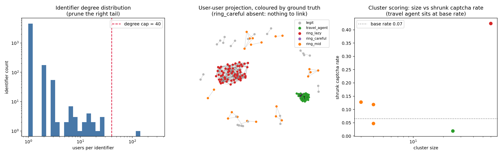
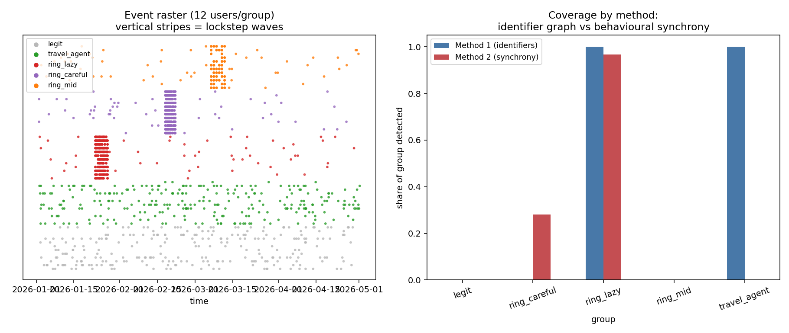
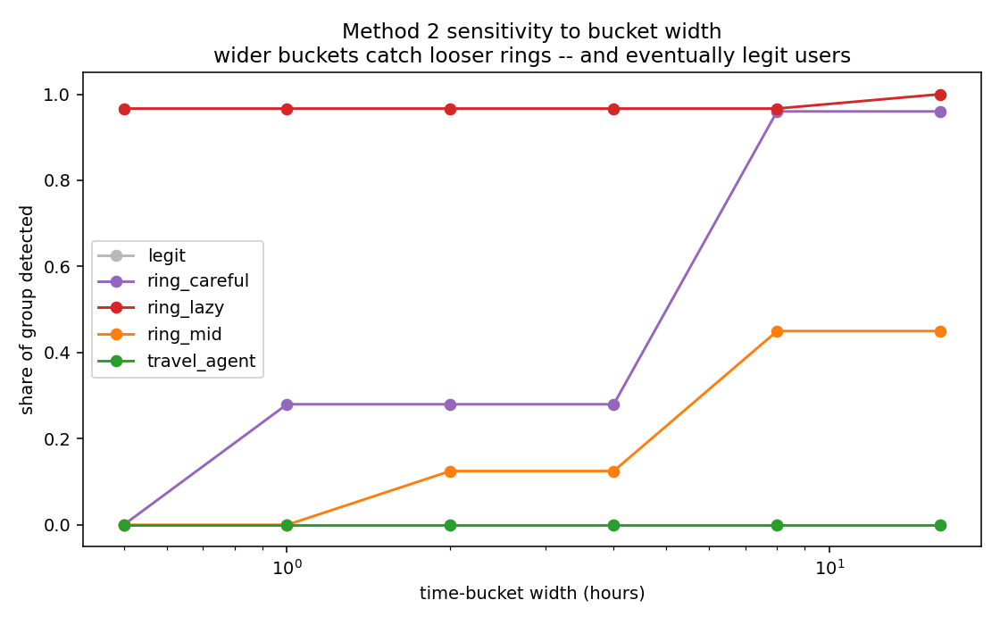

::: {.lead}
This experiment demonstrates two ways of finding coordinated account groups: linking accounts through reused identifiers, and linking accounts through repeated behaviour against the same targets at the same time.
:::

The point is methodological, not operational. The data is synthetic, and the abusive groups are detectable by construction. That makes the experiment useful for seeing the mechanics of each method, but it is not evidence that either method would achieve the same detection rates in production telemetry.

The code for this page lives in `src/openbotrisk/experiments/identifier_synchrony/`. The scripts are kept outside the website tree so the page can stay readable while the implementation remains reproducible.

## What the experiment tests

The synthetic population contains five groups:

| Group | Role in the experiment |
|---|---|
| `legit` | Ordinary users, including households and a shared university network that create benign identifier overlap. |
| `travel_agent` | A benign tight cluster sharing an office IP and card, included as a false-positive trap. |
| `ring_lazy` | An abusive ring with heavy reuse of cards, devices, IPs, and phones. |
| `ring_careful` | An abusive ring with unique identifiers, but coordinated behaviour. |
| `ring_mid` | A mixed case with partial device reuse and looser behavioural synchrony. |

The generated tables are deliberately simple:

- `users.csv` contains accounts, registration time, identifiers, ASN, group label, and a simulated CAPTCHA-hit flag.
- `events.csv` contains timestamped actions against targets.

The ground-truth labels are only available because this is synthetic. In a real setting, those labels would come from review outcomes, confirmed abuse cases, chargebacks, takedowns, or other imperfect feedback loops.

## Synthetic data design

The generator creates a deliberately mixed population rather than a clean "bots versus humans" toy dataset. The important feature is that the benign and abusive groups overlap in ways that force the two methods to fail differently.

```python
# Simplified from src/openbotrisk/experiments/identifier_synchrony/generate_data.py
users.append(dict(
    user_id=uid,
    group="ring_careful",
    reg_ts=T0 + pd.Timedelta(days=40) + pd.Timedelta(hours=float(k * 3 + rng.uniform(0, 2))),
    card=ident("card_", card_i),
    email=ident("em_", email_i),
    phone=ident("ph_", phone_i),
    ip=ident("ip_res_", ip_i),
    asn=rng.choice(["AS_BT", "AS_Sky", "AS_Virgin"]),
    device_id=ident("dev_", dev_i),
    captcha_hit=rng.random() < 0.30,
))
```

For `ring_careful`, every account receives unique identifiers. That makes this ring intentionally hard for the shared-identifier graph. The behavioural signal is introduced separately through campaigns:

```python
def campaign(uids, start, n_waves, wave_gap_h, targets_pool,
             participation=0.9, jitter_s=900):
    for w in range(n_waves):
        wave_t = start + pd.Timedelta(hours=w * wave_gap_h)
        wave_targets = rng.choice(targets_pool, 3, replace=False)
        for uid in uids:
            if rng.random() > participation:
                continue
            for tg in wave_targets:
                events.append(dict(
                    user_id=uid,
                    ts=wave_t + pd.Timedelta(seconds=float(rng.uniform(0, jitter_s))),
                    action=rng.choice(ACTIONS, p=[.5, .3, .2]),
                    target=tg,
                ))
```

That function is the source of the synchrony signal: many accounts touch the same targets in repeated waves, but with enough jitter that the bucket width matters. The legitimate users and travel-agent accounts also generate ordinary browsing events, so the methods have benign overlap to contend with.

::: {.callout-note collapse="true" title="Graph terms used here"}
This experiment uses graph language in a narrow, practical way.

- **Node**: an object in the graph. Here, nodes are either accounts or identifiers.
- **Edge**: a link between two nodes. In the first graph, an edge means "this account used this identifier."
- **Identifier**: a value that can connect accounts, such as a card, phone, email, device ID, or IP address.
- **Bipartite graph**: a graph with two kinds of nodes, where edges only go between the two kinds. Here, one side is accounts and the other side is identifiers. Accounts do not directly connect to accounts at this stage.
- **User-identifier graph**: the specific bipartite graph used here: `account -> identifier`.
- **Projection**: turning the account-identifier graph into an account-account graph. If two accounts share an identifier, the projection creates an account-account edge.
- **Weighted edge**: an edge with a strength value. Here, a shared card is treated as stronger evidence than a shared IP, and an identifier shared by a few accounts is stronger than one shared by many.
- **Connected component**: a set of nodes connected by some path. In an account graph, a component is a group of accounts linked directly or indirectly by shared identifiers.
- **Community detection**: a graph method that splits a large component into denser subgroups. The script uses Louvain community detection for this when a component gets too large.

The key move is the projection. The raw data says "account A used IP X" and "account B used IP X." The projected graph says "account A and account B are linked because they share IP X." That projected account graph is easier to cluster and score.
:::

## Method 1: shared-identifier graph

The first method builds a bipartite graph of users and identifiers, then projects it into a user-user graph. Two users are connected when they share identifiers such as card, phone, device, email, or IP. The method then prunes promiscuous identifiers, weights rarer shared identifiers more strongly, and scores clusters using shrunk CAPTCHA rate and registration burstiness.

The implementation has five stages:

1. Build a bipartite graph between account nodes and identifier nodes.
2. Remove identifiers with too many users, such as carrier NATs, university egress IPs, payment aggregators, or broken/default device IDs.
3. Project the bipartite graph into a weighted user-user graph.
4. Split large connected components with Louvain community detection.
5. Score resulting clusters with simple risk features.

The key parameters are deliberately exposed in the script:

| Parameter | Value | Meaning |
|---|---:|---|
| `ID_TYPES` | card 3.0, email 2.5, phone 2.5, device 2.0, IP 1.0 | Relative strength of each shared identifier type. |
| `DEGREE_CAP` | 40 | Remove identifiers shared by more than this many users. |
| `MIN_EDGE_W` | 0.8 | Remove weak projected user-user edges. |
| `BIG_COMPONENT` | 80 | Run community detection inside components larger than this. |
| `K_SHRINK` | 10 | Pseudo-observations used to shrink noisy CAPTCHA rates toward the base rate. |

The edge weighting is the main anti-naivety move. A shared card between three users means something different from a shared IP between fifty users:

```python
ID_TYPES = {"card": 3.0, "email": 2.5, "phone": 2.5, "device_id": 2.0, "ip": 1.0}

for idn in identifier_nodes:
    members = list(B.neighbors(idn))
    k = len(members)
    if k < 2:
        continue
    id_type = idn.split("::")[0]
    w = ID_TYPES[id_type] / np.log2(1 + k)
    for i in range(k):
        for j in range(i + 1, k):
            add_or_increment_edge(members[i], members[j], weight=w)
```

This is still a small-data implementation. In production-scale data, the same logic would usually move to a graph database, Spark job, igraph/Leiden pipeline, or another system that can handle large projections without materialising too many pairwise edges.

{fig-alt="Three-panel chart showing the identifier degree distribution, a projected user graph coloured by synthetic ground truth, and cluster size versus shrunk CAPTCHA rate."}

This catches the lazy ring because it reuses high-value identifiers. It also shows why naive graph clustering can be dangerous: a shared university egress IP creates a large benign component, and the travel-agent group is a legitimate tight cluster. The method needs pruning, weighting, scoring, and review context rather than a simple rule that any connected component is bad.

The careful ring is mostly absent from this view. That is the failure mode the experiment is designed to surface: if every account has fresh identifiers, an identifier graph has little to connect.

The cluster score uses an empirical-Bayes-style shrinkage step:

```python
BASE_RATE = users.captcha_hit.mean()
K_SHRINK = 10

shrunk = (grp.captcha_hit.sum() + K_SHRINK * BASE_RATE) / (n + K_SHRINK)
```

That stops tiny clusters with one or two CAPTCHA hits from leaping to the top purely because their denominator is small. The score is intentionally simple: it is there to show the pattern, not to propose a deployable risk model.

::: {.callout-note collapse="true" title="Similarity terms used here"}
The second method uses similarity language rather than identifier-linking language.

- **Event**: one recorded action by one account, such as viewing an item or starting checkout.
- **Target**: the thing acted on, such as a product, listing, ticket, slot, page, or booking option.
- **Behavioural token**: a compact representation of an event. In this experiment a token is `(action, target, time_bucket)`, meaning "this account did this thing to this target in this window."
- **Time bucket**: a fixed-width time window. A one-hour bucket groups events into one-hour slices.
- **Overlapping bucket**: a second shifted set of windows. This prevents two almost simultaneous events from being split just because they fall on opposite sides of a bucket boundary.
- **Inverted index**: a lookup table from token to accounts. Instead of comparing every account to every other account, the script first asks "which accounts shared this token?"
- **Candidate pair**: a pair of accounts worth comparing because they shared at least one token.
- **Jaccard similarity**: the size of the overlap divided by the size of the union. If two accounts share many behavioural tokens relative to their total activity, their Jaccard similarity is high.
- **Threshold**: a cutoff for turning a score into a graph edge. The synchrony graph only links accounts if they share enough tokens and their Jaccard similarity is high enough.

The point of Jaccard is to avoid treating two very active accounts as similar just because they have a few coincidences. It asks whether the overlap is large relative to each account's total behaviour.
:::

## Method 2: behavioural synchrony

The second method ignores shared identifiers and instead links accounts that repeatedly perform the same action against the same target in the same time window. The script tokenises events as `(action, target, time_bucket)`, uses overlapping buckets to avoid boundary misses, drops overly popular tokens, and creates edges for account pairs with enough shared tokens and sufficient Jaccard similarity.

The method is inspired by the same general idea as SynchroTrap-style detection: attackers can randomise identifiers, but they still have to coordinate actions around campaign targets. This implementation is intentionally small and readable:

1. Convert each event into one or more behavioural tokens.
2. Build an inverted index from token to users.
3. Count only pairs that share at least one token.
4. Compute pairwise Jaccard similarity for candidate pairs.
5. Build a synchrony graph and keep connected components of at least three accounts.

The overlapping bucket trick is important. Without it, two events one minute apart can fall on different sides of a fixed bucket boundary:

```python
BUCKET = pd.Timedelta(hours=1)

def buckets(ts):
    off = (ts - t0) / BUCKET
    return (int(off), int(off + 0.5) + 10**6)

for r in events.itertuples():
    for b in buckets(r.ts):
        user_tokens[r.user_id].add((r.action, r.target, b))
```

The inverted index avoids comparing every account with every other account:

```python
token_users = defaultdict(list)
for u, toks in user_tokens.items():
    for t in toks:
        token_users[t].append(u)

pair_shared = defaultdict(int)
for t, us in token_users.items():
    if len(us) < 2:
        continue
    if len(us) > TOKEN_USER_CAP:
        continue
    for u, v in combinations(sorted(us), 2):
        pair_shared[(u, v)] += 1
```

The final edge rule uses both an absolute count and a relative similarity threshold:

```python
if shared >= MIN_SHARED:
    jac = shared / (len(user_tokens[u]) + len(user_tokens[v]) - shared)
    if jac >= JACCARD_MIN:
        G.add_edge(u, v, weight=jac)
```

Using both checks matters. `MIN_SHARED` prevents a pair from linking on one or two coincidences. `JACCARD_MIN` prevents very active users from linking just because they share a handful of popular actions among hundreds of unrelated events.

The main parameters are:

| Parameter | Value | Meaning |
|---|---:|---|
| `BUCKET` | 1 hour | Time window for co-occurrence tokens. |
| `JACCARD_MIN` | 0.25 | Minimum behavioural-token similarity for an edge. |
| `MIN_SHARED` | 5 | Minimum number of shared tokens for an edge. |
| `TOKEN_USER_CAP` | 80 | Drop tokens touched by too many users. |
| component size | 3 | Minimum group size to call a synchrony cluster. |

{fig-alt="Two-panel chart showing an event raster with coordinated vertical stripes, and a bar chart comparing identifier graph and behavioural synchrony coverage by group."}

This catches the careful ring because its identifiers are unique but its behaviour is coordinated. It also complements the identifier graph: one method sees shared infrastructure, while the other sees shared timing and targets. The mixed ring is intentionally harder, because loose synchrony and partial reuse sit near the tuning boundary.

## Tuning tradeoff

The bucket-width sweep makes the main tuning problem visible. Narrow windows reduce coincidental co-occurrence, but can fragment coordinated groups with jitter. Wider windows recover looser rings, but admit more ordinary users who happen to touch the same target in the same period.

{fig-alt="Line chart showing share of each synthetic group detected as the behavioural synchrony time-bucket width increases."}

This is the useful lesson from the experiment: behavioural synchrony is not a magic detector. It is a similarity model with parameters, and those parameters trade recall against false positives. The right setting depends on the action type, target popularity, campaign tempo, user base, and review cost.

The sweep reruns the synchrony detector across several bucket widths:

```python
grid = [0.5, 1, 2, 4, 8, 16]
res = pd.DataFrame({b: run(b) for b in grid}).T
```

In this synthetic run, a one-hour window catches most of the lazy ring but only part of the careful ring. Wider windows recover more of the careful and mixed rings because their internal jitter is larger. In real data, the same widening would usually increase benign co-occurrence too, especially around popular targets, sales, outages, announcements, or high-demand inventory releases.

## How to read the outputs

The three figures correspond to three different questions:

| Output | Question it answers |
|---|---|
| `method1_identifier_graph.png` | Which accounts are linkable through shared identifiers, and which clusters look suspicious after pruning and scoring? |
| `method2_synchrony.png` | Which accounts show repeated same-target same-time behaviour, and how does that coverage compare with identifier linking? |
| `method2_bucket_sweep.png` | How sensitive is the behavioural method to the time-window choice? |

The printed console output is also part of the experiment. It reports pruned identifiers, graph sizes, candidate-pair counts, cluster composition, and group-level detection rates. Those are useful checks when changing parameters because a figure can look plausible even when the underlying graph has become too dense or too sparse.

## What this demonstrates

This demonstration supports three limited claims:

- Identifier reuse can reveal clusters that would be missed by single-account scoring.
- Coordinated behaviour can reveal clusters even when account identifiers are unique.
- Both methods need false-positive controls because ordinary users can share identifiers or behaviour for benign reasons.

It does not measure real-world prevalence, production false-positive rates, or adversarial effectiveness. The value is that the failure modes are visible: shared benign infrastructure can fool identifier graphs, and timing windows can make behavioural synchrony either too brittle or too broad.

## Reproducibility

The runnable scripts live in `src/openbotrisk/experiments/identifier_synchrony/`. They generate the synthetic data, rerun both methods, and update the figures used on this page.

```bash
python src/openbotrisk/experiments/identifier_synchrony/generate_data.py
python src/openbotrisk/experiments/identifier_synchrony/method1_identifier_graph.py
python src/openbotrisk/experiments/identifier_synchrony/method2_synchrony.py
python src/openbotrisk/experiments/identifier_synchrony/method2_bucket_sweep.py
```

::: {.callout-note collapse="true" title="Packages used"}
The implementation uses a small Python stack:

- **`pandas`**: stores the synthetic `users` and `events` tables, groups rows, calculates group-level summaries, and writes CSV outputs.
- **`numpy`**: provides reproducible random generation and simple numeric operations.
- **`networkx`**: builds the bipartite graph, projects it into user-user graphs, finds connected components, and runs Louvain community detection.
- **`matplotlib`**: creates the static figures used on this page.

`networkx` is a good choice for this demonstration because it is readable and widely used. It is not the right tool for production-scale account graphs with millions of accounts and high-degree identifiers. At that scale, the same method would usually move to graph databases, distributed jobs, igraph/Leiden tooling, or approximate similarity methods.
:::

The scripts are ordered because Method 2 reads the Method 1 output when producing the combined coverage comparison:

| Script | Reads | Writes |
|---|---|---|
| `generate_data.py` | none | `experiments/identifier-synchrony/generated/users.csv`, `experiments/identifier-synchrony/generated/events.csv` |
| `method1_identifier_graph.py` | `experiments/identifier-synchrony/generated/users.csv` | `experiments/identifier-synchrony/generated/users_m1.csv`, `site/methodology/images/method1_identifier_graph.png` |
| `method2_synchrony.py` | `experiments/identifier-synchrony/generated/events.csv`, `experiments/identifier-synchrony/generated/users_m1.csv` | `experiments/identifier-synchrony/generated/users_final.csv`, `site/methodology/images/method2_synchrony.png` |
| `method2_bucket_sweep.py` | `experiments/identifier-synchrony/generated/events.csv`, `experiments/identifier-synchrony/generated/users.csv` | `site/methodology/images/method2_bucket_sweep.png` |

The generated CSVs are ignored by Git because they are deterministic rebuild artifacts. The figures are checked into the site tree because the website needs them when rendered.

## Possible extensions

There are several natural next experiments:

- Add target popularity spikes to test whether the synchrony method over-links during high-demand events.
- Replace exact Jaccard with MinHash or locality-sensitive hashing to show the scaling path.
- Add reviewed-case uncertainty, where only some accounts have labels and some labels are wrong.
- Add cost-sensitive thresholds, so the detector optimises for review workload rather than raw detection share.
- Compare connected components with Leiden/Louvain communities for dense synchrony graphs.
